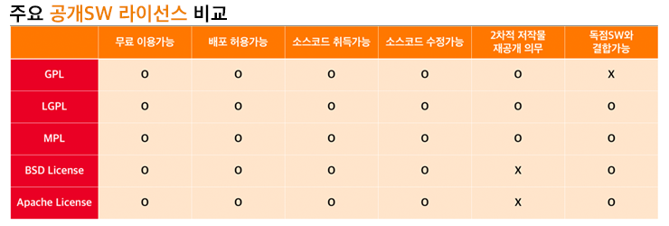

# 오픈이지만 권리는 있어

 오픈 소스 라이선스는 '소프트웨어와 다른 소스 코드, 청사진 또는 디자인은 정의 규정 및 조건에 따라 사용, 수정 및 공유할 수 있도록 허용되는 물건들의 라이선스의 종류' 이다. 오픈소스 라이선스마다 허용하는 항목과 범위가 다르기 때문에 오픈소스 소프트웨어를 이용할 때는 해당 라이선스의 허용 범위를 정확히 확인하고 사용해야 한다.

  이런 라이선스가 왜 필요할까? 

 다음과 같은 예를 생각해보자.

> 어떤 개발자가 모처럼 소스 코드를 공개하고, 온 세상의 개발자에게 그 소프트웨어 개발에 자유롭게 참여하도록 하여 소프트웨어의 개선을 꾀하려고 하였다. 그러나 도중에 다른 누군가가 그 소스 코드를 사용해 다른 소프트웨어를 만들어서, 소스코드를 제공하지 않고 판매했다. 게다가 그 사람이 공개된 소스 코드를 자신이 썼다고 주장하고, 상업적인 권리를 획득했다.

이런 경우, 최초로 오픈소스로서 소프트웨어를 만든 사람의 목적이나 권리가 빼앗겨 버린다. 라이선스가 이를 방지하여 오픈소스 개발자의 의도나 권리를 지켜준다.

 오픈소스를 공개할때 GPL 또는 BSD 라이선스를 붙여서 공개한다. GPL은 소스 코드의 공개를 원칙으로 하고 사용자에게 소스코드를 포함한 재배포나 개조의 자유를 인정해 이를 방해하는 행위를 금지하는 엄격한 조건을 붙이고 있는 반면에, BSD는 무보증,면책을 선언하여 재배포 할 때에 저작권 표시를 행하는 것만을 조건으로 하고 있다.

