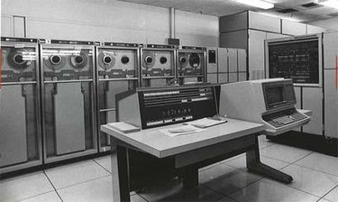

# 컴퓨터와 소프트웨어의 탄생

먼저 오픈소스의 역사를 설명하기 이전에 컴퓨터가 어떻게 탄생하였는지, 그리고 소프트웨어가 어떠한 방식으로 생겨났는지에 대한 기원을 먼저 소개하도록 하겠다. 독자 중 뜬금없이 “왜 컴퓨터의 역사를 설명하는 거지?” 라고 생각하는 분들이 있을지도 모르겠다. 하지만, 오픈소스의 탄생은 사실 컴퓨터의 역사와 그 궤를 같이하고 있다. 이제부터 그 이유를 설명하도록 하겠다.

먼저 중학교 때 컴퓨터 시간에 배운 컴퓨터의 역사에 대해 떠올려보자.

제 2차 세계 대전이 끝난 년도인 1945년에 최초의 컴퓨터라고 불리는 에니악\(ENIAC\)이 탄생한 이후, 10년도 채 되지 않아서, EDVAC, EDSAC, UNIVAC과 같은 많은 컴퓨터가 생겨나기 시작하였다. 하지만 이러한 초창기 컴퓨터들의 공통점은 프로그램을 작성하기 매우 힘들고 까다롭다는 것인데, 그 이유인즉슨, 프로그램을 기계어로 작성을 했어야 했는데 기계어와 같은 경우 컴퓨터는 해석하기가 쉽지만 사람은 이 기계어를 읽고/쓰는, 즉 작성하는 것이 어렵다는 치명적인 단점이 있었다. 이러한 단점은 상업용으로 출시된 UNIVAC 컴퓨터도 똑같이 겪고있던 문제였고, 이를 부분적으로 나마 해결하기 위해 1953년 최초의 상업용 언어인 코볼을 발명한 것으로 유명한 그레이스 호퍼의 주도 하에 A-2 시스템이라는 컴파일러의 링커 또는 ELF나 PE와 같은 OS의 프로그램 로더에 해당하는 프로그램이 개발되었다. 흥미로운 것은, 이 A-2 시스템이 최초로 UNIVAC 컴퓨터 판매와 동시에 저작권 없이 소스코드를 무료로 배포하던 소프트웨어라는 것이다. 즉 오픈소스의 시초가 된 최초의 소스코드가 된 것이다.

![&#xADF8;&#xB808;&#xC774;&#xC2A4; &#xD638;&#xD37C;&#xB294; &#xBBF8;&#xD569;&#xC911;&#xAD6D; &#xD574;&#xAD70;&#xC758; &#xC81C;&#xB3C5;, &#xCEF4;&#xD4E8;&#xD130;&#xACFC;&#xD559;&#xC790;, &#xC218;&#xD559;&#xC790;&#xB85C; A-2&#xC640; &#xCF54;&#xBCFC;&#xC774; &#xD638;&#xD37C;&#xC758; &#xB300;&#xD45C;&#xC791;&#xC774;&#xB2E4;. &#xB610;&#xD55C; &#xCF54;&#xBCFC;&#xC758; &#xAC1C;&#xBC1C;&#xB85C; &#xCF54;&#xBCFC;&#xACFC; &#xCEF4;&#xD30C;&#xC77C;&#xB7EC;&#xC758; &#xC5B4;&#xBA38;&#xB2C8; &#xB77C;&#xB294; &#xBCC4;&#xBA85;&#xC744; &#xAC16;&#xAC8C; &#xB418;&#xC5C8;&#xB2E4;.](../.gitbook/assets/hopper.jpg)

