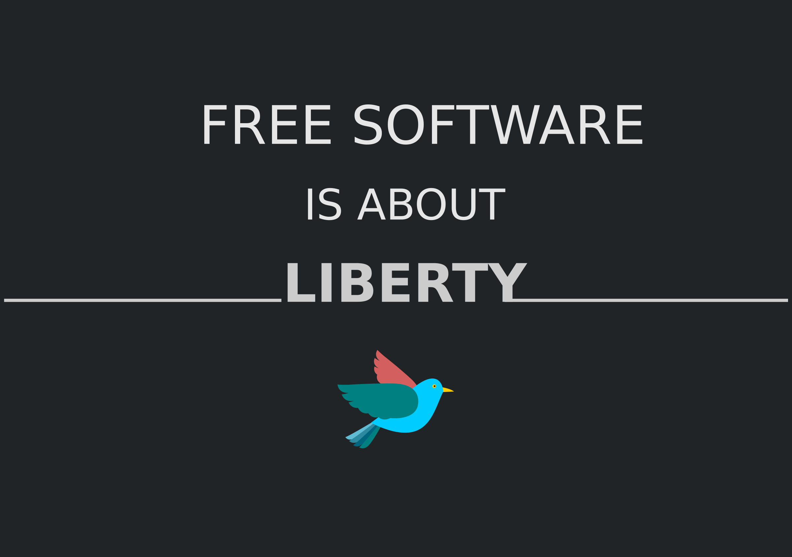

# 자유, 그 무한한 가능성

에릭 레이먼드는 자유 소프트웨어 철학을 '성당과 시장\(the Cathedral and the Bazaar\)'이라는 책을 통해 소개한다. 이 책에서 자유 소프트웨어에 관한 두 가지 모델을 소개한다. 성당 모델은 출시할 때만 소스코드를 공개하고, 이후 제한된 개발자만 소스코드에 접근할 수 있도록 하는 모델이다. 이와 달리 시장 모델은 소스코드가 인터넷을 통해 일반인에게 공개된 상태로, 여러 사람이 참여해 소프트웨어를 견고하게 만드는 모델이다. 이 책은 여러 오픈소스 운동과 자유 소프트웨어 프로젝트에 영향을 줬으며, 이들이 시장 모델을 적용해 여러 명의 개발자가 참여하는 개발 방식을 적용하기 시작했다. 성당 모델의 경우 출시 당시에 소스 코드를 공개한다는 점을 제외하면, 오늘날 상용 소프트웨어를 개발하는 방식과 동일하다. 따라서 성당을 상용 프로그램에, 시장을 누구나 개발에 참여할 수 있는 프로그램에 비유하기도 한다.

리처드 스톨만의 운동은 상당히 급진적이었다. 때문에 소스코드 공개에는 동의하지만, 그의 사상이나 철학에는 동의하지 않는 개발자도 있었다. 결국 이들을 중심으로 자유 소프트웨어 운동과는 성향이 조금 다른 '오픈소스 운동'이 생겨나기 시작했다. Free라는 단어의 해석도 조금씩 달랐다. 자유 소프트웨어 진영은 이 말을 '자유'라는 의미 그대로 해석하는 반면, 오픈소스 진영은 '무료'라는 의미에 초점을 맞춰 이를 바탕으로 새롭고 강력한 소프트웨어를 개발하는 것을 중시한다.

리처드 스톨만은 이 두 가지 노선에 대해 두 개의 정당과 같다고 표현했다. 기본적인 원칙은 다르지만, 현실적인 목표에 관해서는 동일하다는 말도 덧붙였다. 그에게 있어서 공공의 적은 '독점 소프트웨어'기 때문이다.

자유 소프트웨어 운동은 오늘날 상용 소프트웨어를 만드는 기업, 예를 들어 마이크로소프트 등의 기업에게는 허무맹랑한 주장으로 비춰진다. 실제로 리드 스톨만의 주장은 소프트웨어 업계에서 '공산주의'와도 같다. 하지만 이러한 운동은 오늘날 소프트웨어 업계에 많은 영향을 줬다. 파이어폭스를 만든 비영리 재단 모질라부터 HP나 IBM 등의 대기업도 오픈소스 기반 기술에 투자해 개방형 생태계를 꾸리고 있다.

이처럼 자유 소프트웨어 운동\(혹은 오픈소스 운동\)은 개발자의 성과물을 무의미하게 공유하자는 움직임이 아니라 여러 사람의 의견을 수렴할 수 있는 개방형 생태계를 만들고, 더 뛰어나고 가치 있는 성과물로 발전시키자는 것에 의의를 둔다.

