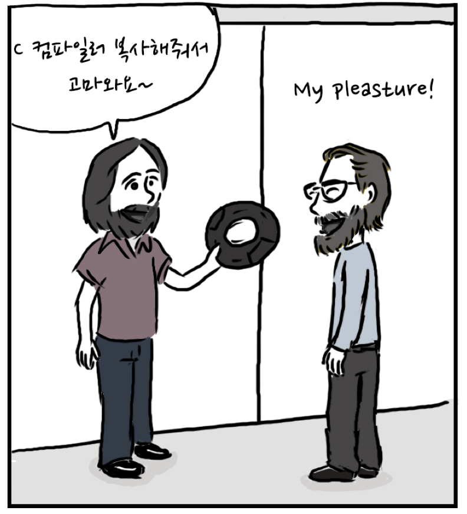

# 변화에 저항하다 - 자유 소프트웨어 운동

### 무료 맥주\(free beer\)가 아닌 언론의 자유\(free speech\)

자유 소프트웨어 운동을 알아보기 위해서는 먼저 자유 소프트웨어 \(free software\) 개념에 대한 이해가 필요하다. 자유 소프트웨어란 사용자가 소프트웨어를 실행하고, 복제하고, 배포하고, 학습하고, 개작하고, 향상시킬 수 있는 소프트웨어를 말한다. 소제목에서 말하듯이 자유 소프트웨어에서 자유 \(free\) 라는 개념은 무료라는 금전적인 측면이 아닌 구속되지 않는다는 관점으로 보는 것이 핵심이다. GNU에서는 자유 소프트웨어가 내포하고 있는 자유를 4가지 종류로 다음과 같이 분류한다.

* \(첫번째 자유\) 프로그램을 원하는 어떠한 목적으로도 실행할 수 있는 자유.
* \(두번째 자유\) 프로그램이 어떻게 동작하는지 학습하고, 자신의 필요에 맞게 개작할 수 있는 자유. 이것을 위해서는 소스 코드에 대한 접근이 전제되어야 합니다.
* \(세번째 자유\) 이웃을 도울 수 있도록 복제물을 재배포할 수 있는 자유.
* \(네번째 자유\) 프로그램을 개선시킬 수 있는 자유와 개선된 이 점을 공동체 전체가 누릴 수 있게 그것을 발표할 자유. 이를 위해서는 역시 소스 코드에 대한 접근이 전제되어야 합니다.

리처드 스톨만은 자유 소프트웨어는 금전적인 개념을 뜻하는 것이 아니기 때문에 자유 소프트웨어를 유료로 판매하는 것에는 아무런 모순이 없다고 말하며 자유 소프트웨어에 사용된 단어 free는 unfettered, 즉 구속에서 벗어났다는 의미에 가장 가깝다는 점을 강조한다. 실제로도 GNU 홈페이지에서는 GNU 소프트웨어는 유료로 구입할 수도 있고 무료로 얻을 수도 있지만, 어떠한 방법으로 소프트웨어를 구했던 간에 사용자들은 해당 프로그램에 대한 복제와 개작의 자유를 항상 갖게 된다고 기재되어있다.

### 독점 소프트웨어의 번성과 해커 공동체의 붕괴

리처드 스톨만은 인공지능 연구소에서 그의 동료와 함께 ITS라 불리는 운영체제를 DEC사의 PDP-10이라는 메인프레임\(다양한 데이터를 처리할 수 있는 대형 컴퓨터\)에 탑재하기 위해 업그레이드하는 작업을 맡았다. 그들은 ITS를 자유 소프트웨어라고 부르지 않았다. 리처드 스톨만에 따르면 당시에는 그런 용어 자체가 존재하지 않았으며, 오늘날 자유 소프트웨어라 불리는 개념 너무나도 당연한 시대였다.

이들의 해커 공동체는 1980년대 초 DEC가 PDP-10 제품군 생산을 중단하면서 무너지기 시작했다. 이 컴퓨터에서 쓰이는 소프트웨어가 호환성 문제로 사용할 수 없게 됐기 때문이다. 1981년에는 인공지능 연구소에서 근무하던 대부분의 해커가 심볼릭스\(Symbolics\)라는 회사를 만들고, 직장을 옮긴다. 기존 PDP-10을 운영할 인적 자원이 부족해진 인공지능 연구소는 ITS가 아닌 새로운 운영체제를 도입한다. 하지만 이 운영체제는 자유 소프트웨어가 아니었다. 이뿐만 아니라 당시 소개됐던 대표적인 컴퓨터의 전용 운영체제 역시 자유 소프트웨어가 아니었다. 이러한 운영체제를 사용하려면 관련 자료\(소스코드 등\)를 유출하지 않겠다는 계약 조건에 동의해야만 했다. 리처드 스톨만은 이에 대해 "컴퓨터를 사용하는 처음 단계부터 주위 사람을 돕지 않겠다고 약속하는 것과 같은 의미"라고 언급했다.

리처드 스톨만은 무너진 공동체를 다시 부활시키길 원했다. 그리고 이를 위해 가장 먼저 해야 하는 일은 운영체제를 만드는 것이라고 판단했다. 운영체제는 컴퓨터를 사용하기 위해 가장 핵심적인 소프트웨어기 때문이다.  따라서 자유롭게 사용할 수 있는 운영체제가 있다면 상호 협력적인 해커 공동체를 재건할 수 있을 것이라 생각했다. 뿐만 아니라 '재배포를 금지한다' 등의 저작권 조건에 구애받을 필요가 없어지므로, 주변 사람의 자유를 침해하지 않고도 누구나 컴퓨터를 사용할 수 있을 것이라 믿었다. 그렇게 리처드 스톨만이 시작한 것이 바로 GNU프로젝트이다.

