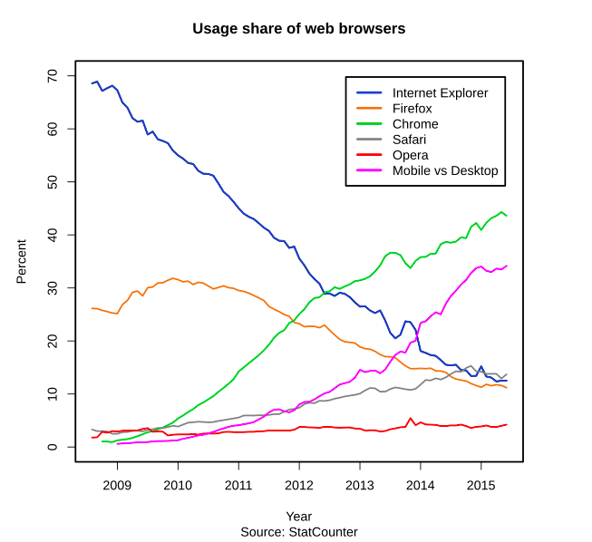

# 브라우저의 두 거장

 당시 CEO 였던 에릭 슈미트는 1차 브라우저 전쟁을 두고 구글은 아직 덩치가 작아 타격을 크게 입을 수 있다는 이유로 6년 간 반대했었다. 결국 창업자인 래리 페이지와 세르게이 브린은 프로젝트의 성공 가능성을 증명해야 했다. 크롬 브라우저의 프로토 타입 개발을 위해 모질라 재단의 인재들을 고용했고, 에릭에게 긍정적인 방향으로 생각을 바꾸도록 하였다.  
  
 모질라 재단에서는 크롬에 대한 발표\(2008년 9월\)가 나자, 격하게 반대하였다. 자신들은 MS 에 대해 충분히 대항 중이고 크롬의 출시는 되려 파이어폭스의 점유율만 갉아 먹었으리라 여겼기 때문이었다. 그리고 그 예상은 좋게 빗나갔다.  
  
 모질라가 2000년~2010년 동안 꾸준히 쌓아왔던 30%의 점유율을 구글은 불과 3년 만에 돌파했고, 2012년을 기점으로 MS 의 점유율을 꺾었기 때문이다. IE 에 비한 압도적인 편의, 경이적인 속도, 날마다 혁신적인 개발 도구 제공 등으로 개발자부터 모든 사용자에 아우르게 되었다. ECMA 등의 표준을 충실하게 지켰고 그보다 더 나아가 실험적인 기술들을 적극 도입함으로서 모두의 지지를 받게 된다.

 국내의 경우 16년 4월을 기준으로 크롬이 점유율 1위를 차지하였다.  
  
 이렇게 제 2차 브라우저 전쟁은 모질라도, MS도 아닌 구글의 승리로 끝나게 된다.

